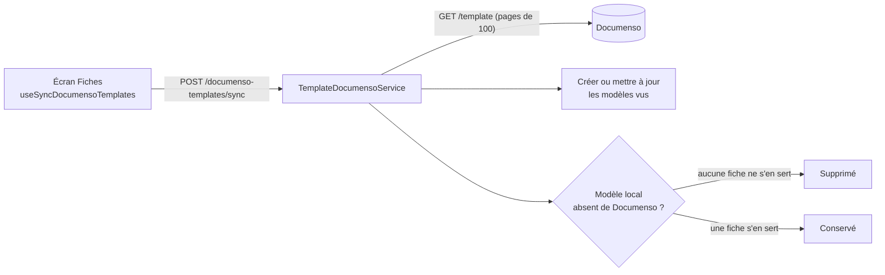
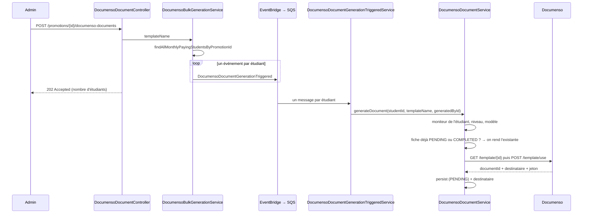
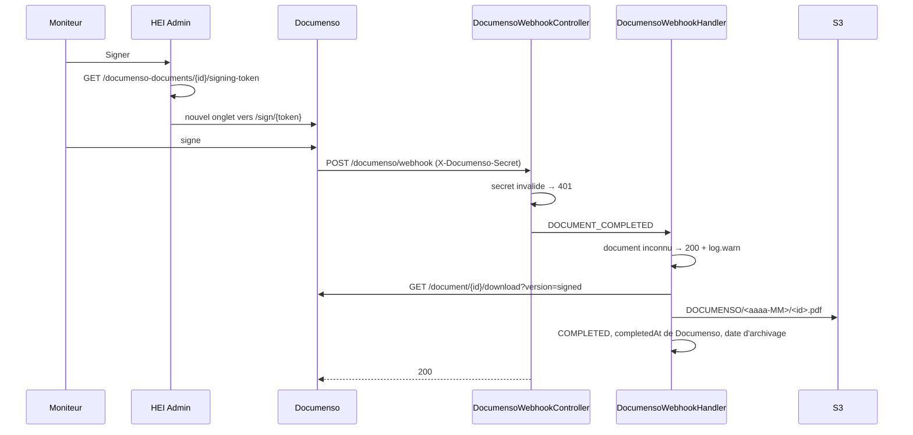
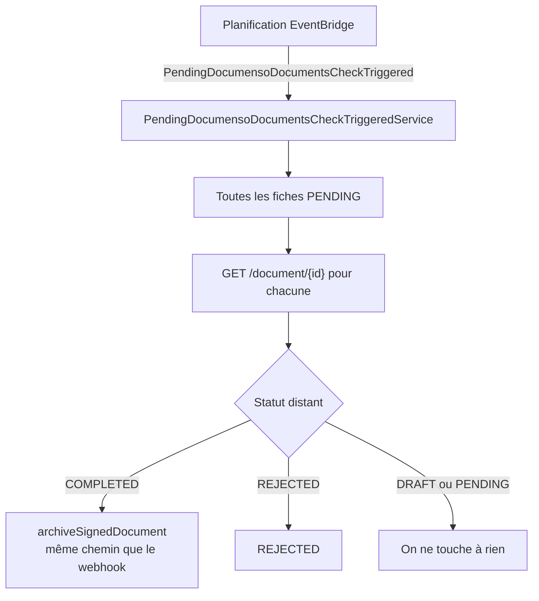
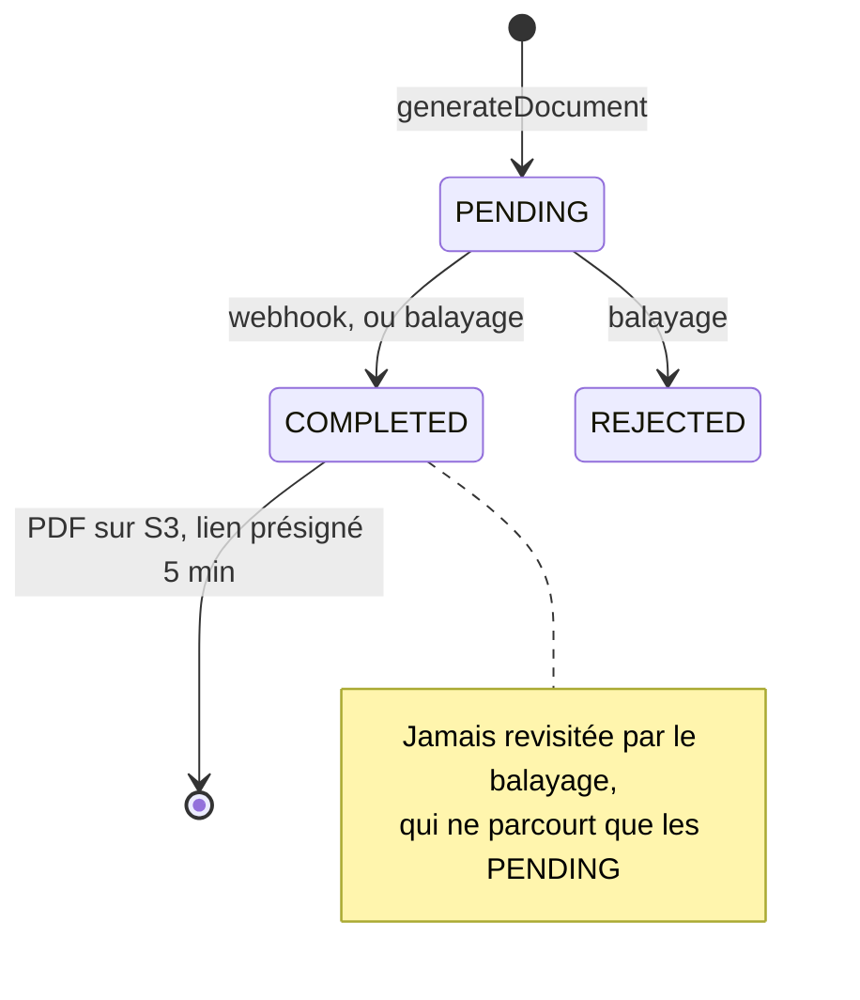

# Documenso — les flux

Fiches d'engagement signées par les moniteurs, via [Documenso](https://documenso.com).
Quatre flux indépendants, dans l'ordre où on les rencontre.

## 1. Synchronisation des modèles

Les modèles sont créés à la main dans l'interface Documenso. HEI Admin n'en tient qu'un
miroir local, rafraîchi à l'ouverture de l'écran.

L'élagage n'a lieu que si la liste distante a été parcourue **en entier** : une page manquée
ferait passer des modèles vivants pour disparus.

## 2. Génération des fiches

Déclenchée par un admin depuis une promotion. Une fiche par étudiant **mensualisé** —
les forfaits annuels sont exclus.

La réponse est un **202** : la génération se poursuit en arrière-plan, fiche par fiche.
Un échec sur un étudiant n'affecte pas les autres.

Deux garde-fous dans `generateDocument` : une fiche encore valable n'est jamais dupliquée,
et le modèle distant doit déclarer **exactement un** signataire — le moniteur. La signature
de l'administration est incrustée dans le PDF du modèle, elle ne passe pas par Documenso.

Seules les données de l'étudiant sont préremplies. Le moniteur remplit les siennes en signant.

## 3. Signature et archivage

Le traitement est **synchrone** : le 200 n'est rendu qu'une fois le PDF déposé et le statut écrit.

Un document inconnu est acquitté avec un `200`, jamais un `404` : Documenso rejouerait
indéfiniment un payload qu'aucune tentative ne pourra satisfaire — ses propres envois de test,
et les orphelins créés quand la persistance échouait.

Deux dates sont conservées, et leur écart est un diagnostic :

| Date | Origine | Lecture |
|---|---|---|
| `completedDatetime` | `completedAt` de Documenso | quand le moniteur a signé |
| `archivedDatetime` | la nôtre | quand on a récupéré le PDF |

Quelques secondes d'écart : le webhook a fonctionné. Plusieurs heures : il s'est perdu et
c'est le balayage qui a rattrapé.

## 4. Le filet de rattrapage

Un webhook perdu laisserait une fiche `PENDING` pour toujours — aucun autre événement ne
viendra la réparer.

Le `DetailType` de la planification doit être le nom **pleinement qualifié** de la classe
d'événement : `EventServiceInvoker` le compare à `clazz.getTypeName()` pour résoudre le service.
Un nom court ne résout rien.

Le coût croît avec le nombre de fiches ouvertes : un appel Documenso par fiche `PENDING`, à
chaque passage. `PENDING` étant l'état normal d'une fiche pendant des semaines, une fréquence
élevée consomme le quota pour rien.

## Cycle de vie d'une fiche

## Points de rupture connus

**Le modèle Documenso commande tout.** Si le placeholder du destinataire est en rôle `VIEWER`,
ou s'il est `SIGNER` sans champ Signature qui lui soit assigné, Documenso clôt le document
immédiatement. La chaîne archivera alors des fiches que personne n'a signées, sans que rien
côté HEI Admin puisse le détecter.

**Le lien de téléchargement** est présigné pour 5 minutes, généré à la demande depuis
`file_info.file_path`. Supprimer une ligne en base rend son PDF inatteignable : l'objet reste
sur S3 mais plus rien ne le référence.

**Le secret du webhook** est comparé en clair. L'endpoint est en `permitAll` dans `SecurityConf` ;
c'est ce secret qui tient lieu d'authentification.
